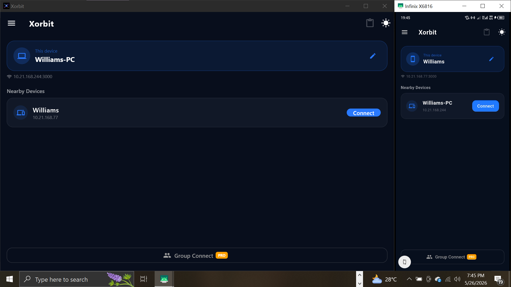
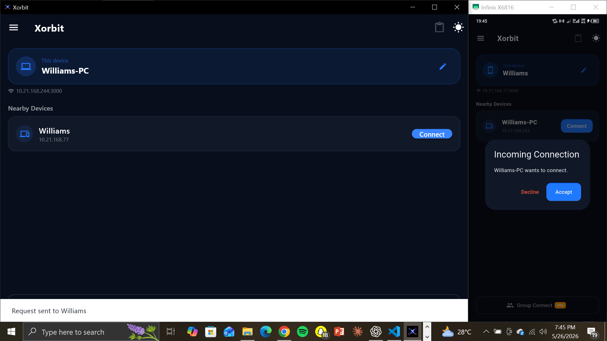
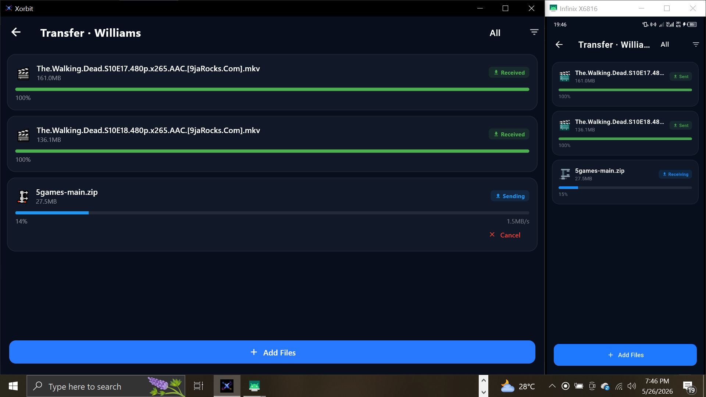

# X-Orbit

X-Orbit is a cross-platform local file transfer app built with Flutter.

## Features
- Fast local file sharing
- Windows ↔ Android transfer
- Clipboard sync
- Cross-platform support
- Transfer History
- Hotspot support
- No Internet 

## Screenshots
# X-Orbit

## Homepage

The homepage provides quick access to checking other available devices and connecting with a clean and modern interface designed for simplicity.

---

## Connection Screen

This screen allows users to approve or reject incoming connection requests from nearby devices.

---

## File Transfer Screen

Users can easily select files and transfer them across devices connected to the same network.

---

## Received Files

.png)

Users can access transfer history and see all past transfers.

---

## Settings, Help and About
_and_Transfer_Page(Android).png)

## How to Use
1. Connect both devices to the same Wifi or connect one of the devices to the other's hotspot
2. Open X-Orbit and send a connection request while the other device accepts the request
3. Click "send files" to select files to send

## Clipboard Sync
- Copy any text from either device
- Click the clipboard button at the top right of the homepage
- Paste on the other device

## Tech Stack
Flutter
Dart

